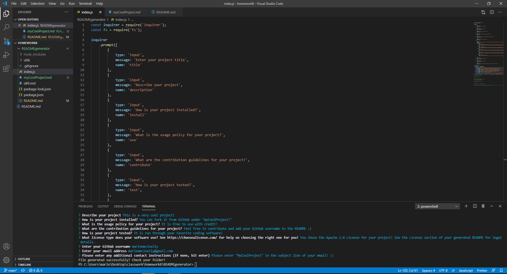
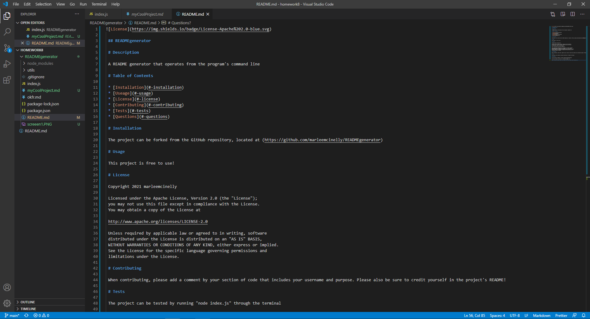

 ## READMEgenerator

 # Description

 A README generator that operates from the program's command line

 # Table of Contents

 * [Installation](#-installation)
 * [Useage](#-usage)
 * [License](#-license)
 * [Contributing](#-contributing)
 * [Tests](#-tests)
 * [Questions](#-questions)

 # Screenshots

 

 This is a look at what running the program will look like using an integrated terminal with VScode

 
 This is an example of a README that can be generated using this project! (As you can see, this project's README was actually generated by it!)

 # Video Demonstration

 (https://drive.google.com/file/d/1KQP9kE6cVrg2FYW_23TQ4JXBbRobwAAe/view?usp=sharing)
 
 You can find a video demonstration of the project by CTRL + clicking the link above 

 # Installation

 The project can be forked from the GitHub repository, located at (https://github.com/marleemcinelly/READMEgenerator)

 # Usage

 This project is free to use!

 # License

 Copyright 2021 marleemcinelly

 Licensed under the Apache License, Version 2.0 (the "License");
 you may not use this file except in compliance with the License.
 You may obtain a copy of the License at

 http://www.apache.org/licenses/LICENSE-2.0

 Unless required by applicable law or agreed to in writing, software
 distributed under the License is distributed on an "AS IS" BASIS,
 WITHOUT WARRANTIES OR CONDITIONS OF ANY KIND, either express or implied.
 See the License for the specific language governing permissions and
 limitations under the License.

 # Contributing

 When contributing, please add a comment by your section of code that includes your username and purpose. Please also be sure to credit yourself in the project's README!

 # Tests

 The project can be tested by running "node index.js" through the terminal

 # Questions?

 You can find me on GitHub at: (https://github.com/marleemcinelly)

 You can also email me directly at: marleemcinelly@gmail.com 

Please include the project name in the subject line of your email when reaching out!